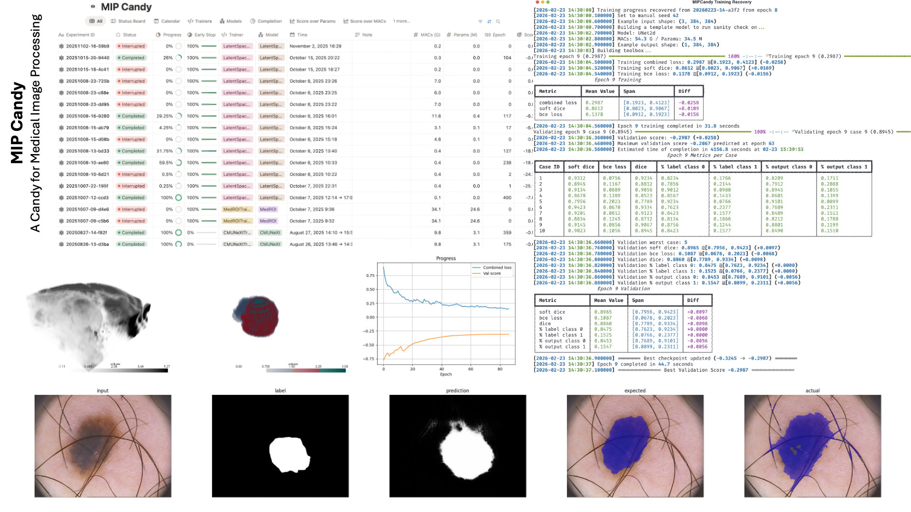

# MIP Candy: A Candy for Medical Image Processing




MIP Candy is Project Neura's next-generation infrastructure framework for medical image processing. It defines a handful
of common network architectures with their corresponding training, inference, and evaluation pipelines that are
out-of-the-box ready to use. Additionally, it also provides integrations with popular frontend dashboards such as
Notion, WandB, and TensorBoard.

We provide a flexible and extensible framework for medical image processing researchers to quickly prototype their
ideas. MIP Candy takes care of all the rest, so you can focus on only the key experiment designs.

:link: [Home](https://mipcandy.projectneura.org)

:link: [Docs](https://mipcandy-docs.projectneura.org)

## Citation

Should you find our work helpful to you, please cite our publication.

```bibtex
@misc{fu2026mipcandymodularpytorch,
    title = {MIP Candy: A Modular PyTorch Framework for Medical Image Processing},
    author = {Tianhao Fu and Yucheng Chen},
    year = {2026},
    eprint = {2602.21033},
    archivePrefix = {arXiv},
    primaryClass = {cs.CV},
    url = {https://arxiv.org/abs/2602.21033},
}
```

## Installation

Note that MIP Candy requires **Python >= 3.12**.

```shell
pip install "mipcandy[standard]"
```

## Quick Start

Below is an example using the ACDC dataset. The example code replicates most of nnU-Net's features but without
augmentations.

```python
from typing import override
from os.path import exists

from monai.networks.nets import DynUNet
from torch import nn
from torch.utils.data import DataLoader

from mipcandy import SegmentationTrainer, AmbiguousShape, auto_device, download_dataset, NNUNetDataset, inspect, \
    load_inspection_annotations, RandomROIDataset


class UNetTrainer(SegmentationTrainer):
    @override
    def build_network(self, example_shape: AmbiguousShape) -> nn.Module:
        kernel_size = [[3, 3, 3]] * 5
        strides = [[1, 1, 1]] + [[2, 2, 2]] * 4
        return DynUNet(spatial_dims=3, in_channels=example_shape[0], out_channels=self.num_classes,
                       kernel_size=kernel_size, strides=strides, upsample_kernel_size=strides,
                       deep_supervision=self.deep_supervision, deep_supr_num=2, res_block=True)


if __name__ == "__main__":
    device = auto_device()
    download_dataset("nnunet_datasets/ACDC", "tutorial/datasets/ACDC")
    dataset = NNUNetDataset("tutorial/datasets/ACDC", align_spacing=True)
    if exists("tutorial/datasets/ACDC/annotations.json"):
        annotations = load_inspection_annotations("tutorial/datasets/ACDC/annotations.json", dataset)
    else:
        dataset.device(device=device)
        annotations = inspect(dataset)
        dataset.device(device="cpu")
        annotations.save("tutorial/datasets/ACDC/annotations.json")
    dataset = RandomROIDataset(annotations, 2)
    train, val = dataset.fold()
    train_loader = DataLoader(train, 2, True, num_workers=2, prefetch_factor=2, persistent_workers=True)
    val_loader = DataLoader(val, 1, False)
    trainer = UNetTrainer("tutorial", train_loader, val_loader, device=device)
    trainer.train(1000, note="example with the ACDC dataset")
```